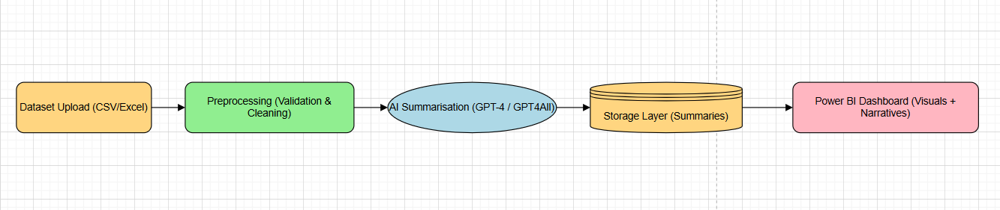

# Cloud-Native AI Powered Data Assistant with Power BI

This project implements a cloud-native AI-powered data assistant that
automatically generates summaries and insights from structured datasets.

The system uses AWS services, OpenAI APIs, and Power BI dashboards
to convert raw data into business insights for non-technical users.

## Architecture

S3 → Lambda → OpenAI → S3 Output → Power BI

## Technologies Used

- AWS S3
- AWS Lambda
- Node.js / Python
- OpenAI API
- Power BI
- GitHub

## Project Workflow

1. Dataset uploaded to S3 input bucket
2. Lambda function triggers automatically
3. Data is processed and sent to OpenAI
4. AI generates summary insights
5. Results stored in S3 output bucket
6. Power BI dashboard visualizes insights

## Architecture Diagram

## Results

Example generated insights:

- Sales increased by 12% in Q3
- Top performing region: North America
- Product category Electronics generated highest revenue

## Challenges Faced

- Lambda deployment size limitations
- Pydantic dependency issues
- OpenAI API cost and subscription
- Power BI integration challenges

## Future Improvements

- Automated Power BI API integration
- Better prompt engineering
- Real-time analytics pipeline
